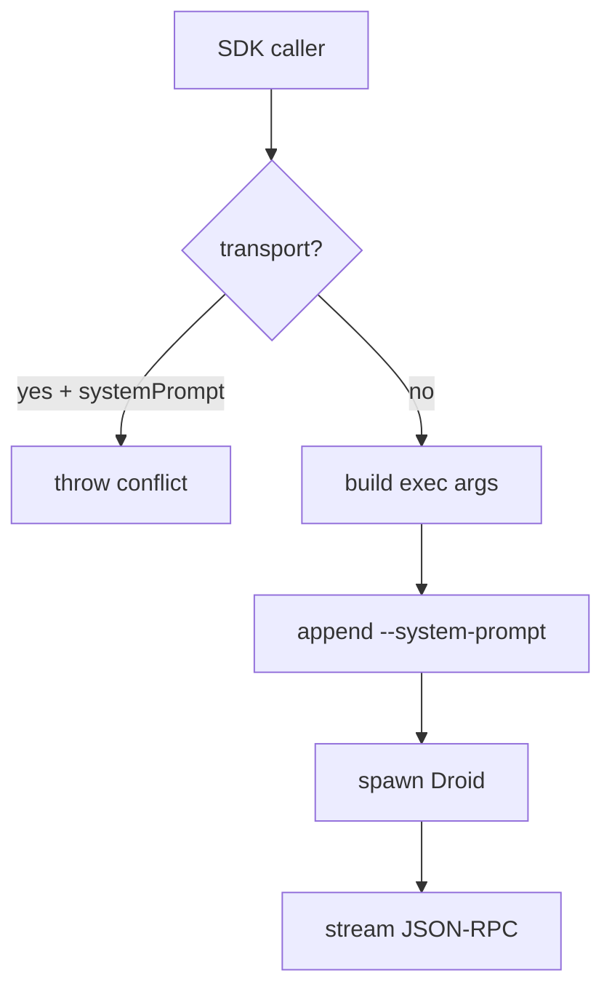

## Goal

Add a Claude Agent SDK-style `systemPrompt?: string` option to the TypeScript SDK, where `systemPrompt` means **replace Droid's configurable main system prompt** for SDK-spawned Droid processes. The SDK must not map this to append behavior.

## Proposed public SDK API

```ts
await run('Hello', {
  systemPrompt: 'You are a helpful support assistant. Be concise.',
});

const session = await createSession({
  systemPrompt: 'You are a strict TypeScript reviewer.',
});

const stream = query({
  prompt: 'Review this diff',
  systemPrompt: 'You are a senior security reviewer.',
});
```

Add `systemPrompt?: string` to the shared process/session option path so it is available through:

- `createSession(options)`
- `resumeSession(sessionId, options)`
- `query(options)`
- `run(text, options)`
- direct `ProcessTransport` construction, if applicable

## Intended behavior

- `systemPrompt` maps to the new Droid CLI startup flag `--system-prompt <text>`.
- It does **not** use `--append-system-prompt`.
- It is process-level startup configuration, not a JSON-RPC request field.
- It only applies when the SDK spawns Droid itself.
- If a caller passes a custom `transport`, `systemPrompt` should throw because the SDK cannot modify an already-provided transport.
- If a caller passes custom `execArgs` that already include `--system-prompt`, and also passes `systemPrompt`, throw a clear conflict error.
- Empty or whitespace-only `systemPrompt` should throw.



## Implementation plan

### 1. Update SDK option types

In `src/types.ts` / shared transport option types:

- Add `systemPrompt?: string` to process/spawn options.

In session/query/run types:

- Ensure `CreateSessionOptions`, `ResumeSessionOptions`, `QueryOptions`, and `RunOptions` inherit it through existing option composition.

### 2. Add exec arg construction helper

Add a small internal helper, for example:

```ts
function buildExecArgs(options: ProcessTransportOptions): string[];
```

Behavior:

- Start from default `['exec', '--input-format', 'stream-jsonrpc', '--output-format', 'stream-jsonrpc']` unless `execArgs` is provided.
- If `systemPrompt` is present:
  - validate non-empty string
  - reject if args already contain `--system-prompt`
  - append `--system-prompt`, `systemPrompt`

### 3. Validate custom transport conflict

In `createTransport()`:

- If `options.transport && options.systemPrompt`, throw a clear `ConnectionError` or `Error` explaining that `systemPrompt` only works when the SDK spawns Droid.

### 4. Add tests

Add focused tests around argument construction / transport spawning:

- `ProcessTransport` includes `--system-prompt <text>` when `systemPrompt` is passed.
- Empty `systemPrompt` throws.
- Passing `systemPrompt` with custom `execArgs` already containing `--system-prompt` throws.
- Passing `systemPrompt` with supplied `transport` throws.
- Existing behavior without `systemPrompt` remains unchanged.

### 5. Add or update example

Update or add a user-facing example that imports from the package entrypoint style and demonstrates:

```ts
await run('Say hello', {
  systemPrompt: 'You are a concise assistant.',
});
```

Examples should not mock transport or use offline behavior.

### 6. Run validators

Run:

- `npm run typecheck`
- `npm run typecheck:examples`
- `npm run format:check`
- `npm run lint`
- `npm test`
- `npm run build`

## Dependency on Droid CLI

This SDK change assumes Droid CLI has or will have a true replacement flag:

- `--system-prompt <text>`

The SDK should only expose `systemPrompt` for now and should not expose append behavior.
